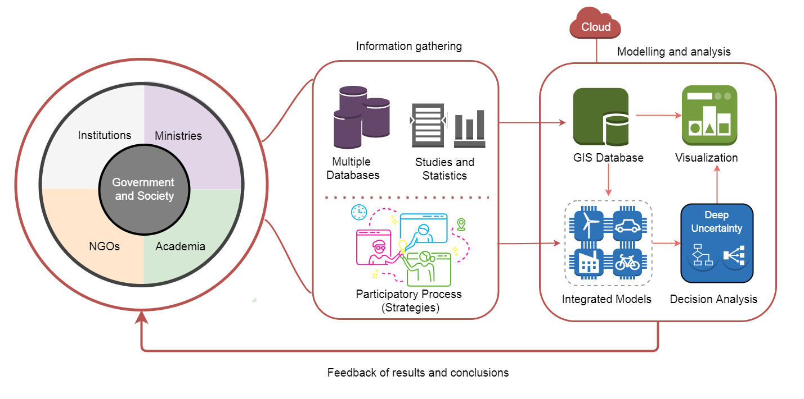

.. Title:

1. Introducction
=====================================

Since 2015, the Paris Agreement and the Sustainable Development Goals boosted an unstoppable movement to combat climate change and build strong economic foundations for all countries. It is a transformative process that promotes universal access to affordable and reliable energy services along with innovative transport systems :cite:`FusoNerini2018` ,FusoNerini2019,SLOCAT20,SLOCAT20-rev. In general, country-driven strategies in this sectors are based on three pillars\cite{Waisman2019}: i) energy efficiency and conservation, ii) renewable energy sources, and iii) low-carbon technologies. From this classification, the following specific actions emerge: distributed electricity generation, storage technologies, the deployment of smart grids, the growth of Industry 4.0, urban planning, smart mobility,  modal shift and electrification of transportation.
\cite{8392503,8386915,8386932,LEONG2020122870,Tranpor_sust}. In addition, Citizens are playing a more active role, and it is foreseen that in the near future, they will have mechanisms to carry out energy commercial transactions . \cite{Ines2020, HUA2020115539}. As a result, the transition to a low-carbon future is changing the way we plan, operate and regulate our systems.

Costa Rica has an extensive tradition of nature protection and leadership to fight climate change, however, Critical challenges remain unresolved in the transport and energy sectors. In 2018, the country joined the Latin American Deep Decarbonisation Pathways Project (DDP-LAC), a collaborative global scientific community to support nationally appropriate decarbonisation long-term strategies\cite{IDB2019, Bataille2020,Batt_20}. With this alliance, researchers from the University of Costa Rica (UCR)  with the Directorate of Climate Change (DCC) of the Ministry of Environment and Energy (MINAE), the KTH Royal Technological Institute in Stockholm, and later the Rand Corporation work together to support Government´s strategies towards sustainable development. Through Open Source Energy Modelling System (OSeMOSYS) \cite{GARDUMI2018209} and principles of Robust Desición Making (RDM) \cite{Lempert2021} method we find evidence of the cost-benefit relationship of these technological, economic and social transformations, considering the effect of uncertainty. \cite{Jairo5P,GODINEZZAMORA2020100573,Groves2020}. Progressively, the team strengthened its capacities, tools and abilities, which allowed to transfer the knowledge  to another country in the region (Peru) demonstrating that Costa Rican work is a reliable study reference. \cite{Quiros-Tortos2021}.  

1.1 Motivation and Problem Statement 
+++++++++

Previous experiences provide important evidence on how academia can help governments to design strategies by combining qualitative and quantitative assessments, similar to \cite{IfG_2018}. For Costa Rica and Peru, our results show that decarbonisation bring socio-economic benefits and constitute an important step in the right direction. Nowadays, the main motivation is to continue contributing to the sustainable development of different countries through the creation of new knowledge and computational tools. To better understand this panorama and advance according to current trends , we need to highly detailed information and new techniques to data processing \cite{PFENNINGER201474,Pye-21,Chang2021, FRYSZTACKI2021116726,Markov2021}. The complexity of these interrelationships challenges conventional decision-making structures due to social and economic uncertainties, technical, spatial and temporal resolutions, modelling transparency and accessibility, and engagement between model developers and stakeholder \cite{Savvidis2019,Morrison2018,Pfenninger2018, Hulk2018}. 

Ignoring these new approaches increases the risk that supports to decision-makers will not be the most effective. Therefore, this work focuses with enhancing current modelling tools and decision-making methods developed in Costa Rica in order to reach another level of innovation. Another main focus of this research will be the analysis of power and transportation networks, considering that they require special attention according to the pillars of global strategies. \cite{FRYSZTACKI2021116726,Markov2021}. Here, there is still a wide field for researchers to contribute, especially about the consideration of operations dynamics into long-term planning for balancing optimal and robust solutions. In addition, this work addresses challenges such as the integration of computational tools, the design of reliable experiments and the application of modern data analysis techniques to communicate results. Regarding accessibility to the scientific community and the general public, the proposal includes the application of best modelling and simulation practices and the use of open-source tools \cite{DeCarolis2017, Howells2021}. As a synthesis,  the following general research question is presented: 

How can a set of high-resolution modelling tools work efficiently in an open-source computational environment to improve decision analysis towards the sustainability of transport and energy systems under deep uncertainty conditions?

The development of an open-source analytical framework to study the national-scale decarbonisation pathways and sustainability strategies began with a philosophical approach, questioning the procedures to connect the system with socioeconomic effects. Furthermore, it was about having the ability to transcend simple human mental mapping and provide a broader assessment of possible futures in a universe of solutions. The inherent transformation in the transport and electricity industries to achieve sustainable development and the complex dynamics resulting from their integration suggest a more specialised approach. New research lines will emerge in the following years.

1.2 Decision-making for sustainability: State of the Art
+++++++++

The purpose of this section is to know the latest research within this work’s focus area. We provide an overview of decision-making methods, analysis under uncertainty, energy modelling systems, high-resolution simulation for energy systems, and transport demand systems, and computational platforms. Accepting that the open-source tools are mature enough for serious use and that the programming language Python was selected to create the project (due to extension libraries and popularity), we explore the tool that can be taken into account to be used, considering properties such as computational flexibility, maintenance, stability, and scalability \cite{Groissbock2019}.  

According to \cite{Malekpour2020}, there are two prominent approaches for long-term planning under uncertainty: Decision Making under Deep Uncertainty (DMDU) and Transition Management (TM). While DMDU provides analytical concepts and tools to prepare for change (based on the participatory process), TM offers a governance approach to condition change (based on interventions). Conceptually, a DMDU-TM coupling can enrich decision analysis; however, research is required to provide empirical evidence. Currently, five DMDU approaches have been defined \cite{Marchau2019}, which share the same principles, show significant evolution, and can be complementary to each other or combined with other analysis methods \cite{Kwakkel2016,Moallemi2020,Bartholomew2020}. They all combine participatory processes, explore scenarios, analyse strategies' vulnerabilities, and present adaptation or contingency plans to respond to changing and unpredictable situations. Nowadays, there is a new research line in which DMDU benefits from machine learning, including data gathering, scenario selection (understanding the model output), enhancing high-dimensional sampling techniques, and most efficient scenarios discovery \cite{DM_ML2, s21113791,GIUDICI2020104681}. 

In general, energy models are used within decision-making methodologies for the exploratory stage. In this area, optimization models are by far the most popular and there is consensus that a certain degree of complexity with acceptable computational performance is necessary to obtain accurate results and approximate the real-world  \cite {TRUTNEVYTE2016182,PRIESMANN2019113783}. These are flexible models with which you can study a wide range of problems flexibly and can be accompanied by methods to high-resolution energy planning \cite{PFENNINGER20171, DeMoura2018, ALIRAHMI2020112426}. However, the art of dealing with uncertainties has recently become a focal point of interest \cite{SOROUDI2013376}. Indeed, some works have been criticised for failing to address the deep uncertainties and suggest advance from
optimisation to robustness\cite{Workman2020,WORKMAN2021127} 

Power systems play a crucial role in sustainable development especially for the smart grids concept as enabler. Under this new dynamic, authors in \cite{Juha_2019} present a detailed analysis of how traditional energy planning requires taking into account operational details and improving spatio-temporal resolution to obtain some more realistic investments. Here, a comprehensive classification of previous work indicates that there is no predominant method, on the contrary, there is a wide range of approaches. Some proposals include moderate application using energy linear optimisation models to study renewable energy sources, storage and smart grids \cite{Welsch2012a, Welsch2014,WELSCH2014600}, soft-links between specific models (usually under licencing) \cite{DEANE2012303,BELDERBOS201533}, modelling of multi-energy systems \cite{PMaca216,PMaca216_2,GABRIELLI2018408}, and co-optimization process \cite{Pal_1,Pal_2}. In this context, a trade-off must be made between calculation time and modelling fidelity. According to our experience, a soft-link between energy model and power systems simulators is most flexible solution. Taking this into account, we introduce two open-source tools compatible with the industrial solution: pandapower \cite{Pandas} and OpenDSS \cite{OpenDSS}, due to their compatibility, the potentiality to make stable state analysis and the possibility to introduce external control algorithms.

The transport sector represents one of the most challenging sectors to model because of data intensive and uncertainty. Authors in \cite{Grosso2017,Grosso_2,Brozynski2018} presents a case of study to establish optimal decarbonisation pathways that include transportation in energy optimization models. In this context, the transport sector corresponds to a set of technologies coupled to energy sources and demands. In this line, \cite{Fattori2014a,TATTINI2018571, Tattini2018a,AHANCHIAN2019849,SALVUCCI2019113593} incorporate an endogenous modal shift and determine the optimal technology combinations based on the cost task function, subject to environmental goals, infrastructure requirements, and smart control strategies for electric vehicles. Applications presented in  \cite{Mittal2017,Zhang2018} use a top-down modelling approach, based on computational general equilibrium model considering factors such as time of travel, energy efficiency improvement, load factor, mode preferences, land-use patterns, and carbon taxes. They conclude that this kind of linkages between models enrich the transport representation and helps to study the cost of decarbonisation process. Thus, to complement the capabilities of modelling, we propose a flexible link between energy and transport simulator in order to provide a more realistic demand. In this sense, an open-source alternative called Multi-Agent Transport Simulator (MATSim) \cite{MATsim} is the most advanced model on getting a detailed spatial and time characterisation of mobility. 

In terms of computational requirements, this work can use a minimum hardware set-up consisting of a simple system of two redundant servers (production and backup) with output to a truncal network. The advanced simulations will be carried out at the High Technology Center - CeNAT. Regarding software, the recent advances in web service suggest that Linux - Ubuntu  \cite{Ubunto} is extremely powerful and Docker \cite{Docker} is considered the best option due to its flexibility,  portability, and efficiency in the use of available resources compared to a virtual machine. Related to data management, an appropriate structure must be developed to guarantee the integrity rules of syntaxis, relations and semantics and efficiency while allow concentrating a large amount of georeferenced information such as hydrology, solar radiation or vehicle fleet. For this task, a spatial relational database using Postgresql \cite{Postgresql}, combining with QGIS \cite{QGIS} and GISQUICK \cite{GISQUIK_1} is a great option. A compliment for visualization is the link Plotly \cite{plotly}. For documentation, there are many options, but we consider the combination between Sphinx \cite{sphinx} and the Github \cite{Github} repository quite convenient. For multi-user collaborative environment, we found extraordinary possibilities with JupyterHub \cite{JupyterHub}. Indeed, \cite{Jupy_note} present an explanation of why this particular tool has exploded in popularity in recent years.

1.3 Analysis Approach and Hypothesis
+++++++++

The debate on the energy and transport transition posed by most of the world's governments should focus on achieving social goals. Progressively, countries will have to modify their governmental structures to face this new order and minimise the risks.  In this context, an analytical approach such as Decision Making Deep Uncertainty (DMDU) constitutes an excellent reference for solving this problem. The paradigm underlines the need to prepare and adapt to unpredictable conditions instead of traditional methods of "predict and then act". The benefits of this approach are obtained mainly in the presence of complex systems and in circumstances where uncertainty cannot be well characterised. Indeed, there is a condition of deep uncertainty when decision-makers do not know or disagree on the probability of their strategies' impact. The first stage of the method is mainly qualitative and responds to a process of co-creation with decision-makers. The second is based on the simulation of multiple futures that capture the effect of uncertainty in strategies and measure a level of performance

The technological and socioeconomic transformation towards sustainability is a complex phenomenon due to the inherent uncertainty of the variables and the conflicting interests of the interest groups. In this context, the most widespread tool to help meet long-term planning is participatory backcasting. This approach uses workshops with stakeholders, creativity methods, evaluations, and interactive social learning to define a realistic future vision. With this information, data analysts and modellers define base scenarios and additional plausible futures by formal experimental design, combining multiple parameters in modelling tools. Then, hundreds or thousands of simulations are executed to generate evidence and show vulnerabilities or disadvantages of the proposed strategies. Finally, a set of visualisation tools are established to report the results to stakeholders, promoting feedback. Due to the computational effort, simulations and data processing are generally developed using parallel programming and machine learning techniques. 

The design a computer system starts with the abstraction of a universe to be a model. Then it is necessary to define paradigms and methodologies, establish the infrastructure and software, create an architecture and finally implement it in a modular way. For example, the construction of energy models begins with a simple representation that captures the general behaviour of the systems and progressively grows to study situations that are more complex by increasing granularity, incorporating entities and resources or new algorithms. Likewise, the computational requirements also increase and incorporate new people with different knowledge and perspectives. In this context, traditional desktop systems represent a limiting factor for researchers concerning collaborative work, simulation times, and the common use of data. The alternative to solve this problem is to use cloud computing to implement web-based platforms for modelling and simulation. It represents several advantages of this web service, such as accessibility, scalability, maintenance, controlled access, and licensing. Figure \ref{framework} shows the general concept to develop.

   *Figure 1.1: Proposal of an open-source decision-making framework for sustainable planning in energy and transport sectors.*

