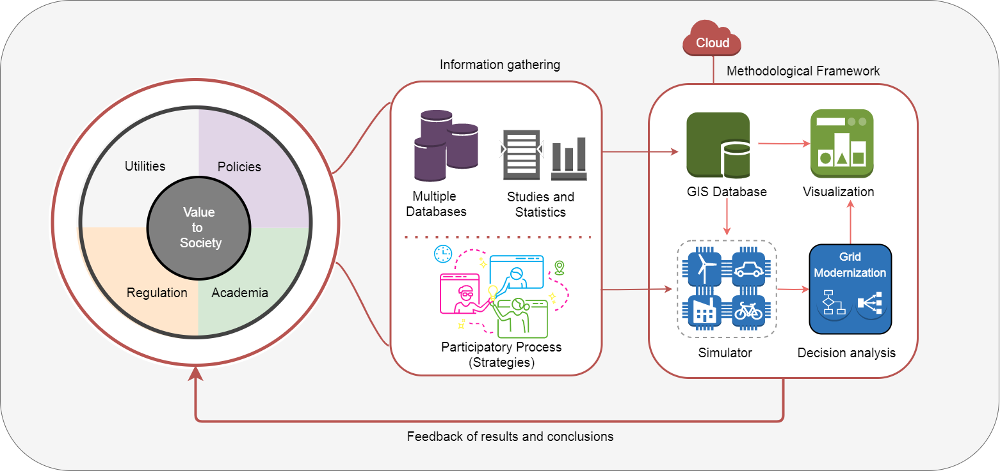
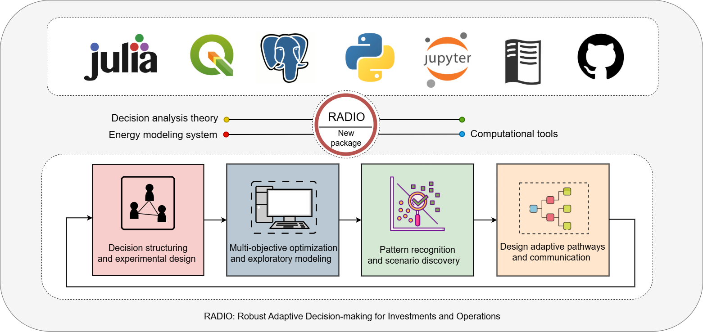

.. Title:

1. Background and Motivation
=====================================

The Paris Agreement and the Sustainable Development Goals boosted the global 
movement to combat climate change and build strong economic foundations worldwide :cite:`FusoNerini2018, FusoNerini2019`. In energy sector, this transformational process advocates for universal access to affordable and reliable services. Country-driven strategies are based on three pillars: energy efficiency and conservation,  renewable energy sources, and  the use low-carbon technologies :cite:`Waisman2019`. As a consequence, power systems are continuously transitioning from centralized grids to highly decentralized ones due to the widespread deployment of distributed energy resources:distributed generation,
distributed energy storage, energy efficiency, demand response and electric vehicles :cite:`city22,city_DERS22, FLEX23`. The grid of the future will be characterized by integration of smart technologies, business digitization and dynamic markets. Consequently, governments and utilities are adapting their planning, operation, and regulation of energy markets :cite:`Future22,Ox_21, TX_Plan21,Dx_plan_22,Ela21,Strbac21,TIM23`. Grid modernization is the process of investing in adecaution electrical network infrastructure and cyber-physical systems to meet the sustinable targets of the 21st century :cite:`Modernization21`. Here, there is still ample opportunity to make significant contributions, particularly in supporting decision-makers. 

This work proposes a comprehensive framework aimed at guiding power grid modernization, with a particular focus on prioritizing investments in distibution systems, valuing cost-benefits, and addressing uncertainty. Leveraging the Decision Analysis dicipline, we integrate a participatory process with stakeholders, multi-objective optimization, exploratory modeling, and scenario discovery, enabling the creation of adaptive pathways whithin multiple plausible futures. Besides the mandatory consideration for power grid modelling, simulation and stochastic analysis, we  employing portfolio stress-testing to discern the conditions under which strategies will or will not meet their goals.  The feasibility of implementing this framework will be demonstrated through IEEE standard test feeders and a real case study conducted for the National Power and Light Company in Costa Rica. Furthermore, we provide a set of best practices, principles, and open source computational tools to ensure transparency, reproducibility, and scintific integrity of the work.

1.1 Motivation and Problem Statement 
+++++++++

Costa Rica has a strong tradition of nature protection and climate change leadership. Through its participation in the Latin American Deep Decarbonisation Pathways Project (DDP-LAC), the country showcased the technical feasibility of deep decarbonisation and its potential socioeconomic benefits, considering the effect of uncertainty :cite:`IDB2019,Bataille2020,Batt_20`. This collaborative scientific project established Costa Rican work as reference study and facilitated the transfer of methodology, capacities, tools, and abilities to other countries in the region, such as Peru :cite:`Quiros-Tortos2021`, This provide reliable evidence of how academia can assist governments in designing strategies:cite:`sasse_2018`. The motivation of this work is to continue making contributions to the sustainable development of diferent countries through the creation of novel knowledge and the development of advanced computational tools. Currently, the primary emphasis is on guiding the transformation of the power system based on the concept of smart grids as an enabler of sustainability. 

In the last decade, significant efforts have been directed towards studying smart grids within the context of integrated energy planning. Several approaches have been proposed, ranging from the utilization of energy optimization models to soft-links between energy models and power system simulators, multi-energy systems modelling, and co-optimization techniques :cite:`Welsch2012a,Welsch2014,WELSCH2014600, DEANE2012303,BELDERBOS201533,PMaca216_2,GABRIELLI2018408, Pal_1,Pal_2,Juha_2019`. Indeed, there is no dominant approach; nevertheless, a consensus exists that attaining precise results and emulating real-world situations requires a certain degree of complexity in modelling, coupled with satisfactory computational performance :cite:`TRUTNEVYTE2016182,PFENNINGER20171,PRIESMANN2019113783,Pye-21,Chang2021, Resulution_21`. Furthermore, addressing uncertainties has emerged as a significant focal point of interest prompting a shift from mere optimization towards robustness :cite:`Workman2020, WORKMAN2021127`. Uncertainty emerges when decision-makers lack clarity or consensus related to the impact of their strategies.

Understanding the complexity associated with power grid modelling and simulation, as well as addressing the inherent technological, regulatory, and socioeconomic uncertainties, critical for effective support to decision makers :cite:`jule_21_100`.
For instance, the substantial integration of distributed energy resources demands more than mere investments in physical infrastructure; it requires enhancements in operator visibility, communication systems, and advanced applications for grid management :cite:`Bigdata_23`. In addition, citizens are actively participating in energy transactions, and it is foreseen the need for new regulatory mechanisms and business models to adapt to this trend in the near future :cite:`Ines2020,HUA2020115539`.This conditions challenging the traditional metodologies for distribution system planning. To address these gaps, utilities are defining roadmaps with specific objectives for infrastructure adequation and customer-centered strategies. However, the need arises to develop novel methodologies, particularly for prioritization of investment, interactions of components (physical and cyber-physical), accounting of benefits (monetary and non-monetary), addressing uncertainty, reliability assurance, security enhancement, and transparent decision support :cite:` Modernization_roadmap,Modernization_CBA, Modernization_Innovation`. As a synthesis, the following general research question is presented:

1.2 Decision Framework
+++++++++

The debate on the energy transition should center on attaining social objectives through the integration of citizens, academia, government, and utilities. DMDU constitutes an excellent approach to solving this problem, wherein paradigm underlines the need to prepare and adapt to unpredictable conditions instead of traditional methods of "predict and then act". The benefits of this approach are obtained mainly in the presence of complex systems and under circumstances where uncertainty cannot be well characterized. Indeed, there is a condition of deep uncertainty when decision-makers do not know or disagree on the probability of their strategies' impact. The initial stage of this approach is predominantly qualitative and involves a collaborative  process with decision-makers. Subsequently, the second phase entails the simulation of multiple scenarios that capture the impact of strategies, thereby quantifying the level of performance. Figure 1.1 shows the general concept to develop.

This framework contains functionalities related to the acquisition and preparation of data for modeling, sourced from dispersed databases, government policies, market references, or previous research. A second external source of information is generated during the participatory process with stakeholders and decision-makers, which is linked to strategies and key metrics. A second source of information is generated during the participatory process with stakeholders and decision-makers, which is linked to the definition of strategies, uncertainties, and performance metrics.With this information, data analysts and modellers define base scenarios and additional plausible futures by formal experimental design. Subsequently, numerous simulations are executed, ranging from hundreds to thousands, to generate empirical evidence and unveil vulnerabilities or drawbacks associated with proposed strategies. The culmination, effectively communicate through visualization tools outcomes to stakeholders, encouraging valuable feedback.

   *Figure 1.1: The general concept for decision-making in sustainable planning for the power grid.*

The design a computer system starts with the abstraction of a universe to be a model. Then it is necessary to define paradigms and methodologies, establish the infrastructure and software, create an architecture and finally implement it in a modular way. Figure \ref{framework_Specific} illustrates the proposed methodological framework, which integrates an analysis sequence based on DMDU principles with a computational platform. The primary phase encompasses the generation of a decision-making matrix, acting as the input for the subsequent multi-objective optimization process employing genetic algorithms. Within this phase, the evaluation of investment portfolios occur across diverse potential scenarios through computational experimental design, incorporating Latin-hypercube sampling. A subsequent stage aims to reveal patterns within the expansive dataset and  vulnerability zones, leveraging machine learning algorithms such as logistic regression and classification by decision trees. The ultimate stage involves the establishment of pathways to prioritize strategies based on performance metrics. In accordance with customary practices observed in methodological frameworks, contributions stem from the development of computational aplication that integrate various other computational tools. In this case, we introduce new python package called RADIO: Robust Adaptive Decision-making for Investments and Operations

   *Figure 1.1: Proposed Methodological Framework for Distribution Grid Modernization.*

