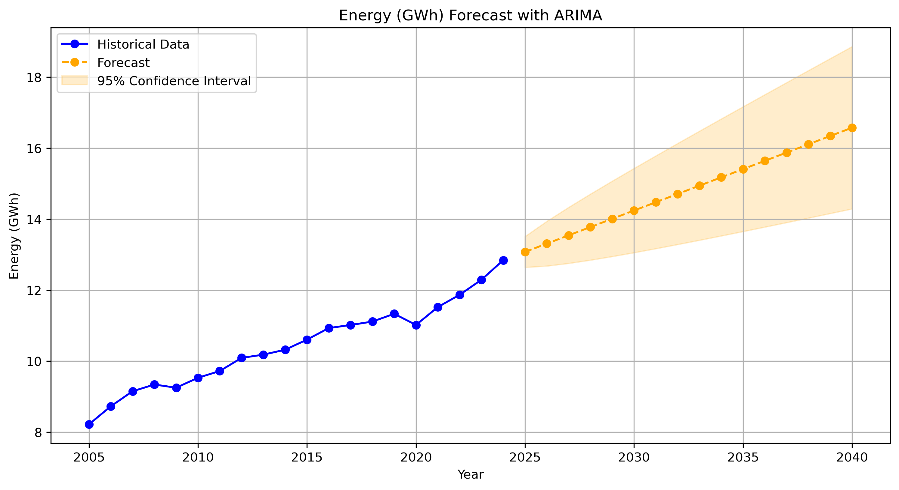
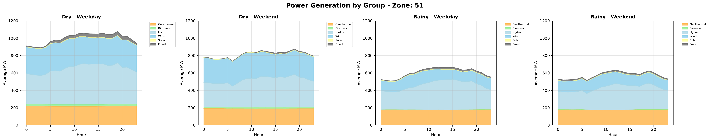
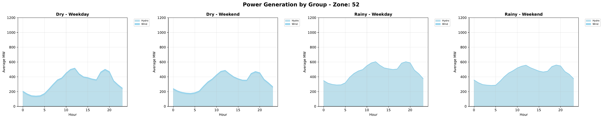
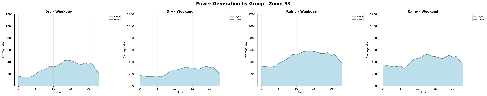
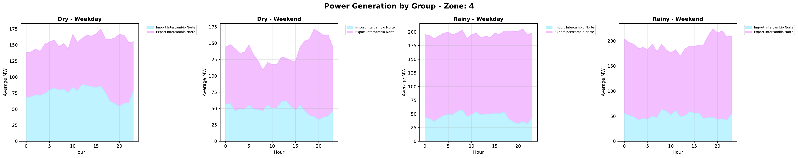
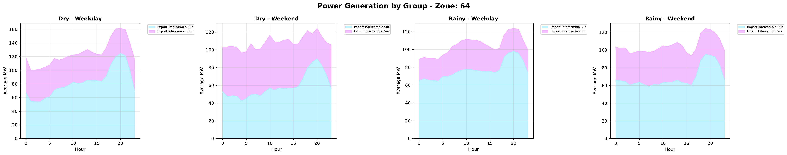
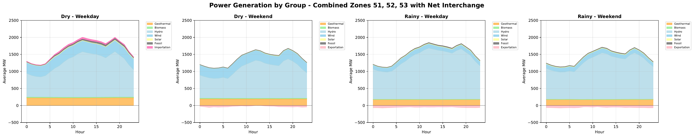
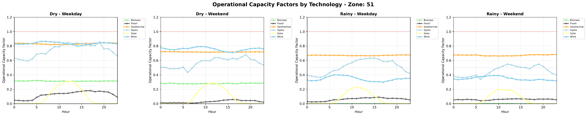
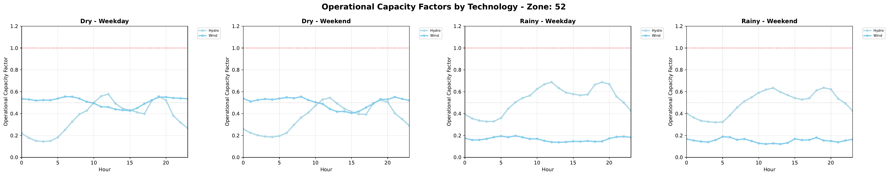

4. Power Sector Modeling 
=======================================

4.1 Modeling approach
+++++++++

4.2 Model structure
+++++++++

(i.e. temporal space, geographic space, elements of the system, etc.)

Technologies, fuels, emissions  

.. figure:: Figures/CR_Regions.png
   :align:   center
   :width:   600 px
   
   *Figure 4.1: Historical and Forecasting electricity consumption by sector in Costa Rica* 

4.3 Electricity Demand 
+++++++++
Based on the historical data of the energy balance, the demand projections were developed by using ARIMA models. These models are one of the most widely used approaches for time series forecasting. They correspond to simple univariate models focused on the long trend trajectory of the different time series. Their general structure is shown below:

General equation: 

.. math::

   \phi \left(B\right){\phi}_s\left(B\right)Z_t=\mu +\theta \left(B\right){\theta }_s\left(B\right)a_t
   
Simple delays: 
 
.. math::

   \phi \left(B\right)=1-{\phi }_1B-{\phi }_2B^2-...-{\phi }_pB^b\ \wedge \ \ \phi \left(B\right)=1-{\phi }_{1s}B^s-{\phi }_{2s}B^{2s}-...-{\phi }_{Ps}B^{Pb}
   
.. math::
   
   \theta \left(B\right)=1-{\phi }_1B-{\phi }_2B^2-...-{\phi }_qB^q\wedge \ \theta \left(B\right)=1-{\phi }_{1s}B-{\phi }_{2s}B^{2s}-...-{\phi }_{Qs}B^{qs}

where *ϕ* corresponds to operators, *μ* is the media  of *ϕ*, *θ* is a coefficient, and *s* is a stational component. 

This forecasting model gives good approximations of the data registered by institutions. The estimation begins with the analysis and forecasting of the time series corresponding to the primary sources. With these long term values, a specific trend is fixed by using the shares defined in the base year. A Hierarchical process was develop considering that the shares by each sector are the same on the base year.

   
   *Figure 4.1: Historical and Forecasting electricity consumption by sector in Costa Rica* 

-Specified Annual Demand

-Specified Annual Demand

-Series intervention 

4.4 Supply and performance

Capacity Factor
Availability Factor
Operational Life
Residual Capacity
Input Activity Ratio
Output Activity Ratio

   
   *Figure XXX: Generation Region 1* 

   
   *Figure XXX: Generation Region 2* 

   
   *Figure XXX: Generation Region 3* 

   
   *Figure XXX: Interchange Nicaragua* 

   
   *Figure XXX: Interchange Panama* 

   
   *Figure XXX: Generation National and Interchange* 

   
   *Figure XXX: Operational CF R1* 

   
   *Figure XXX: OperationalCFR2* 

4.5 Technology costs

Capital and Fixed

4.6 Decision Parameters and Variables 
+++++++++

CREAM Data & Model Specification
================================

.. contents::
   :local:
   :depth: 2

Scope & Resolution
------------------
- **Regions:** 5 (see ``data/set_regions.csv``)
- **Timeslices:** 96 representative hourly slices per year (see ``Notes on timeslices``)
- **Planning years:** 2025, 2030, 2035, 2040, 2045, 2050
- **Final year treatment:** snapshot (``YDM[2050] = 1``)
- **Currency:** constant USD2020
- **Power unit:** MW, **Energy unit:** MWh

Sets
----
.. list-table::
   :header-rows: 1
   :widths: 20 30 50

   * - Symbol
     - CSV
     - Description
   * - :math:`R`
     - ``data/set_regions.csv``
     - Regions (5 entries), column: ``region``
   * - :math:`T`
     - ``data/set_technologies.csv``
     - Specially for power plants, column: ``technology``
   * - :math:`F`
     - ``data/set_fuels.csv``
     - Power for electricity networks, column: ``fuel``
   * - :math:`H`
     - ``data/set_timeslices.csv``
     - Representative hours, column: ``timeslice``
   * - :math:`Y`
     - ``data/set_years.csv``
     - Planning years (2025:5:2050), column: ``year``
   * - :math:`S`
     - ``data/storage_set_techs.csv``
     - Storage technologies, column: ``storage``
   * - :math:`L`
     - ``data/trans_set_links.csv``
     - Transmission links, columns: ``link_id, region_i, region_j``

Year Weighting
--------------
.. code-block:: text

   YearlyDifferenceMultiplier (YDM)
   - 2025,2030,2035,2040,2045 -> 5 (years represented by the node)
   - 2050 -> 1 (snapshot)

Parameters (Data Dictionary)
----------------------------
**Key:** Indices shown as tuples of set symbols.

.. list-table::
   :header-rows: 1
   :widths: 22 20 18 12 12 16

   * - Name
     - CSV 
     - Indices
     - Units
     - Default
     - Notes / Source
   * - AnnualDemand
     - ``param_demand_annual.csv``
     - (Y,R,F)
     - MWh/year
     - —
     - Annual energy demand. Source: utility stats.
   * - DemandProfile
     - ``param_demand_profile.csv``
     - (R,H,F)
     - p.u. (sum_H=1)
     - 1/|H|
     - Normalized hourly shape. One per (R,F). If omitted, uniform.
   * - OutputActivityRatio
     - ``param_activity_ratio_output.csv``
     - (T,F)
     - MWh_out per unit-activity
     - —
     - Maps activity to outputs (OSeMOSYS-style).
   * - InputActivityRatio
     - ``param_activity_ratio_input.csv``
     - (T,F)
     - MWh_in per unit-activity
     - —
     - Maps activity to inputs (OSeMOSYS-style).
   * - VariableCost
     - ``param_cost_variable.csv``
     - (Y,T)
     - USD/MWh_out
     - —
     - Variable O&M on output basis.
   * - InvestmentCost
     - ``param_cost_investment.csv``
     - (Y,T)
     - USD/MW_new
     - —
     - Overnight CAPEX.
   * - FixedCost
     - ``param_cost_fixed.csv``
     - (Y,T)
     - USD/(MW·year)
     - 0
     - Fixed O&M per MW-year.
   * - CapacityFactor
     - ``param_capacity_factors.csv``
     - (R,H,T)
     - p.u. [0–1]
     - —
     - Time-varying for VRE; for dispatchables can be flat.
   * - MaxCapacity
     - ``param_capacity_max.csv``
     - (Y,R,T)
     - MW
     - large
     - Siting/technical cap.
   * - ResidualCapacity
     - ``param_capacity_residual.csv``
     - (Y,R,T)
     - MW
     - 0
     - Existing stock at year y.
   * - OperationalLife
     - ``param_lifetime.csv``
     - (T)
     - years
     - —
     - Tech lifetime for cohort accounting & salvage.
   * - TagDispatchableTechnology
     - ``param_tag_dispatchable.csv``
     - (T)
     - {0,1}
     - 1
     - 1=dispatchable; 0=VRE-like.
   * - EmissionRatio
     - ``param_activity_ratio_emission.csv``
     - (T)
     - tCO2/MWh_out
     - 0
     - Emission intensity per MWh output (single-fuel case).
   * - AnnualEmissionLimit
     - ``param_emission_limit.csv``
     - (Y)
     - tCO2/year
     - large
     - Policy cap per year.
   * - StorageInvestmentCost
     - ``storage_param_cost_investment.csv``
     - (Y,S)
     - USD/MWh_energy_new
     - —
     - Energy capacity CAPEX.
   * - StorageFixedCost
     - ``storage_param_cost_fixed.csv``
     - (Y,S)
     - USD/(MWh·year)
     - 0
     - Fixed O&M per MWh-year.
   * - E2PRatio
     - ``storage_e2p_ratio.csv``
     - (S)
     - hours
     - —
     - Energy-to-power ratio; Pmax = E/E2P.
   * - StorageChargeEfficiency
     - ``storage_param_efficiency_charge.csv``
     - (S,F)
     - p.u.
     - —
     - Charge efficiency.
   * - StorageDischargeEfficiency
     - ``storage_param_efficiency_discharge.csv``
     - (S,F)
     - p.u.
     - —
     - Discharge efficiency (>0 means storage is enabled for F).
   * - StorageLosses
     - ``storage_param_losses.csv``
     - (S,F)
     - p.u./timeslice
     - 1.0
     - Retention per step (1 = no losses).
   * - MaxStorageCapacity
     - ``storage_param_capacity_max.csv``
     - (Y,R,S)
     - MWh
     - large
     - Upper bound on energy capacity.
   * - StorageOperationalLife
     - ``storage_param_lifetime.csv``
     - (S)
     - years
     - —
     - Lifetime for salvage & cohorting.
   * - ResidualTransCap
     - ``trans_param_capacity_residual.csv``
     - (Y,L)
     - MW
     - 0
     - Existing interregional capacity.
   * - MaxTransCap
     - ``trans_param_capacity_max.csv``
     - (Y,L)
     - MW
     - large
     - Upper bound by corridor.
   * - MinCapInvest
     - ``trans_param_capacity_min_investment.csv``
     - (Y,L)
     - MW
     - 0
     - Minimum lump size (enforces binary “build-or-not”).
   * - InvCostTrans
     - ``trans_param_cost_investment.csv``
     - (Y,L)
     - USD/MW_new
     - —
     - Line CAPEX per MW.
   * - FixCostTrans
     - ``trans_param_cost_fixed.csv``
     - (Y,L)
     - USD/(MW·year)
     - 0
     - Annual O&M per MW.
   * - LossFactorTrans
     - ``trans_param_losses.csv``
     - (L,F)
     - p.u.
     - 0
     - Fractional losses; efficiency :math:`\eta=1-\text{loss}`.
   * - TransLife
     - ``trans_param_lifetime.csv``
     - (L)
     - years
     - —
     - Lifetime for salvage & cohorting.
   * - DiscountRate
     - *(code constant)*
     - —
     - p.u./year
     - 0.05
     - Social discount rate.
   * - YearlyDifferenceMultiplier
     - *(code-generated)*
     - (Y)
     - years
     - 5 (2025..2045), 1 (2050)
     - Year weighting (block vs snapshot).

Variables
---------
.. list-table::
   :header-rows: 1
   :widths: 26 22 18 34

   * - Name
     - Indices
     - Units
     - Interpretation
   * - TotalCost
     - (Y,R,T)
     - USD
     - Tech total cost in year y (OPEX + Fixed·YDM + CAPEX).
   * - FuelProductionByTechnology
     - (Y,R,H,T,F)
     - MWh
     - Output fuel from technology.
   * - FuelUseByTechnology
     - (Y,R,H,T,F)
     - MWh
     - Input fuel to technology (linked via InputActivityRatio).
   * - NewCapacity
     - (Y,R,T)
     - MW
     - Newly installed capacity.
   * - AccumulatedCapacity
     - (Y,R,T)
     - MW
     - Installed capacity alive in year y (cohorted).
   * - AnnualTechnologyEmissions
     - (Y,R,T)
     - tCO2
     - Annual emissions by tech and region.
   * - Curtailment
     - (Y,R,H,F)
     - MWh
     - Unserved/curtailed fuel at node.
   * - SalvageValue
     - (Y,R,T)
     - USD
     - Tech salvage (positive value; subtracted in objective).
   * - NewStorageEnergyCapacity
     - (Y,R,S,F)
     - MWh
     - New storage energy capacity (enabled when discharge eff. > 0).
   * - AccumulatedStorageEnergyCapacity
     - (Y,R,S,F)
     - MWh
     - Storage energy capacity alive in year y.
   * - StorageCharge / StorageDischarge
     - (Y,R,S,H,F)
     - MWh
     - Charge and discharge energy flows.
   * - StorageLevel
     - (Y,R,S,H,F)
     - MWh
     - State of charge.
   * - TotalStorageCost
     - (Y,R,S)
     - USD
     - Storage cost (CAPEX + Fixed·YDM).
   * - StorageSalvageValue
     - (Y,R,S)
     - USD
     - Storage salvage (subtracted in objective).
   * - NewTransCap
     - (Y,L)
     - MW
     - New transmission capacity.
   * - AccumTransCap
     - (Y,L)
     - MW
     - Transmission capacity alive in year y.
   * - FlowPlus / FlowMinus
     - (Y,H,L,F)
     - MWh
     - Directed flows (i→j) and (j→i).
   * - TotalTransmissionCost
     - (Y,L)
     - USD
     - Transmission cost (CAPEX + Fixed·YDM).
   * - TransmissionSalvageValue
     - (Y,L)
     - USD
     - Transmission salvage (subtracted in objective).
   * - BuildTrans
     - (Y,L)
     - {0,1}
     - Binary “build-or-not” for minimum lump size.

Notes on Timeslices
-------------------
- 96 slices represent typical weekly/seasonal and diurnal variation.
- Demand profiles are normalized per (R,F) so that
  :math:`\sum_{h \in H} \text{DemandProfile}(r,h,f) = 1`.
- If using capacity factors for VRE, ensure their averaging matches the timeslice construction.

File Layout
-----------
.. code-block:: text

   docs/
     data/
       set_regions.csv
       set_technologies.csv
       set_fuels.csv
       storage_set_techs.csv
       trans_set_links.csv
       param_*.csv
       storage_*.csv
       trans_*.csv
   _static/
     capacity_factors.png
   index.rst
   model_spec.rst   <-- (this file)

